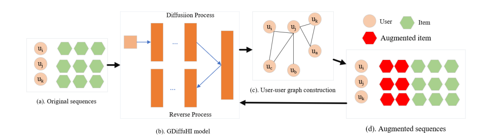

# GDiffuASR

This is a PyTorch implementation for our [GDiffuASR]paper:

> Xian Mo, Hang Qi, Yongqiang Nai and Hao Liu. GDiffuASR: Sequential Recommendation with Guided Diffusion Augmentation. 

## Overview
Traditional sequential recommendation approaches represent items as fixed vectors. These vectors have limited capability in capturing the latent aspects of items and the diverse preferences of users. As a new generative paradigm, diffusion models have shown significant performance in data augmentation for sequential recommendation, with their advantage in distribution generation and diverse representation. In this paper, we make the first attempt to adapt the diffusion model to sequential recommendation and propose the GDiffuASR model to address the issue of data sparsity in sequential recommendation. This model advocates for the direct use of users' original interaction sequences to infer interactions among users for data augmentation. Additionally, we introduce a GDiffuHI strategy, using noisy user embeddings to guide user embedding reconstruction and dynamically infer the strength of interactions among users, ensuring that the generated data consistently benefits the diffusion-enhanced model. Based on the constructed user-user graph for data augmentation, we sample the common items of user neighbors as user-enhanced items, and fine-tune the previously constructed diffusion model parameters for sequential recommendation without complex training processes. Experimental results on three datasets demonstrate that our GDiffuASR model is competitive with various state-of-the-art baselines.

## Requirements
- Python 3.8.11
- PyTorch 1.8.0
- numpy 1.23.4
  
Our code has been tested running under a Linux desktop with NVIDIA A100 80GB PCIe. 

## Usage
You can run the below command for model training and evaluation.
    ```
    python main.py --dataset amazon_beauty
    ```


